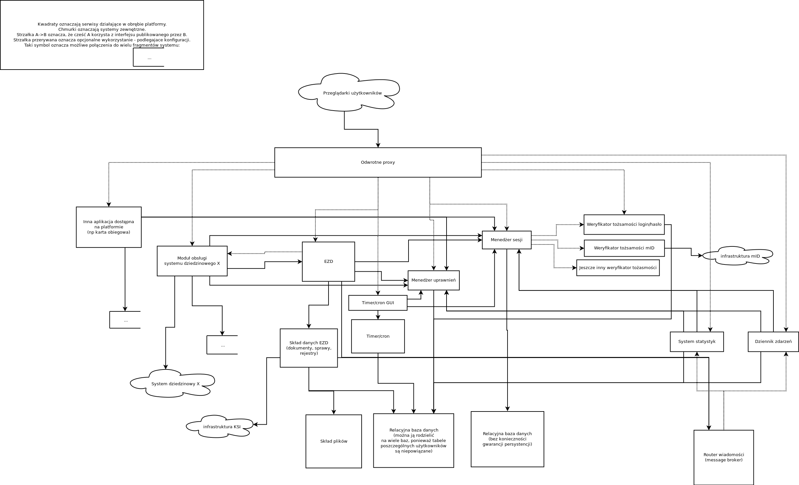

Architektura platformy aplikacje.gov.pl - szkic
===============================================

Cel
---

Odpowiedź na pytanie „W jakim języku programowania pisany jest system, jakiej bazy danych używa i czy dostępne są materiały opisujące architekturę rozwiązania.”

Opisanie szkicu architektury platformy aplikacje.gov.pl

Krótka odpowiedź
----------------

* architektura: mikroserwisy
* język programowania: dowolny, uruchamialny w środowisku linuksowym
* baza danych: dowolna, uruchamialna w środowisku linuksowym, najlepiej w architekturze serwer-klient

Mikroserwisy
------------

Moduły (serwisy) działające w obrębie platformy będą oddzielnymi programami. Między sobą będą komunikować się przez sieć, np przez HTTP (inne protokoły też są dopuszczone). Dla przykładu relacyjna baza danych też będzie serwisem, do którego inne serwisy będą mogły się połączyć specyficznym dla niej protokołem.

Serwisy będą uruchamiane w środowisku linuksowym.

Pisanie kodu nowych serwisów to pisanie programów. Język jest dowolny, o ile można go uruchomić na platformie linuksowej. Kompilacja może się odbywać na platformie nie-linuksowej. Serwis może korzystać z innych serwisów - ich adresy powinny być konfigurowalne (np. w pliku konfiguracyjnym lub w wywołaniu linii poleceń). Program powinien mieć możliwość przyjmowania tych adresów jako nazw hostów i dekodowania ich zapytaniami DNS, ponieważ adresacja w sieci może być dynamiczna.

Dużym ułatwieniem przy uruchamianiu serwisów jest ich bezstanowość - dlatego powinny być bezstanowe tak bardzo jak tylko się da. (Bezstanowość oznacza, że reakcja serwisu na żądanie jest zdeterminowana przez parametry żądania i treść odpowiedzi na inne żądania, wykonywane przez serwis. Nie zależy ona od tego co działo się z serwisem przed żądaniem — to znaczy, że serwis nie może pamiętać swojej historii). Celem jest możliwość łatwego skalowania - dowolnego niszczenia i tworzenia instancji serwisów.

Mając napisany zestaw serwisów, które komunikują się między sobą tworzą „usługę”, można je wszystkie uruchomić na jednym albo wielu komputerach, przydzielając im odpowiednie adresy portów i przekazując odpowiednie namiary na serwisy, od których zależą. Umieszczenie wielu serwisów na jednym komputerze może być wygodne do testowania na wczesnym stadium rozwoju. Docelowe rozrzucenie na kilka komputerów może wynikać z analizy obciążenia.

   Schemat komunikacji mikroserwisów w obrębie Platformy.

Kontenery Docker
----------------

Docelowo w projekcie będzie (prawdopodobnie) użyta konteneryzacja Docker’a (https://www.docker.com/products/docker-engine). Każdy serwis otrzyma swoje własne, lekkie, odizolowane od innych serwisów środowisko – kontener. Docker będzie zarządzał adresacją sieci w sieciach wirtualnych, routingiem, podłączeniem kontenerów do sieci i wpisami DNS serwowanymi wewnątrz tych sieci, dzięki czemu serwisy będą mogły komunikować się między sobą.

Użycie docker-engine w trybie docker swarm mode pozwala na rozpraszanie kontenerów pomiędzy wiele maszyn.

Docker-compose (https://docs.docker.com/compose/overview/) jest narzędziem, które prawdopodobnie zostanie użyte w projekcie, być może tylko jako narzędzie deweloperskie. Docker-compose odpowiada za łatwe budowanie środowiska złożonego z wielu, zależnych między sobą kontenerów.

Frontend
--------

Nie wszystkie serwisy będą mieć frontend (GUI - interfejs graficzny użytkownika, dostępny jako strona internetowa), jednak serwisów z frontendem będzie więcej niż jeden. W celu zapewnienia współpracy pomiędzy poszczególnymi częściami frontendu proponowane jest następujące rozwiązanie:

Każdy serwis serwuje swoją stronę, używając być może wspólnych komponentów, np CSSów i wspólnych bibliotek elementów w celu zapewnienia spójności graficznej. Odwrócone proxy (np nginx) łączy GUI serwowane na wielu adresach w GUI serwowany na jednym adresie, z poszczególnymi GUI dostępnymi pod określonymi ścieżkami.

Serwisy, które chcą wewnątrz swojego GUI załączyć GUI innych serwisów robią to za pomocą iframe. Przy użyciu tej technologii mogą zostać zbudowane integratory takie jak Osobisty Pulpit, Dashboard, tj. mikroserwisy integrujące ze sobą aplikacje (aby zmniejszyć potrzebę uruchamiania aplikacji w wielu kartach).

API poszczególnych serwisów
---------------------------

Komunikacja pomiędzy serwisami odbywać się będzie za pośrednictwem sieci. Serwisy, które są używane przez inne serwisy muszą mieć dokładnie opisane API. Dobrze określone API może pozwolić na abstrakcję od konkretnej implementacji, co z kolei pozwala na łatwą wymianę implementacji.

Architektura platformy nie powinna, by nie nakładać ograniczeń, określać wszystkich interfejsów programistycznych, których używają serwisy uruchomione na platformie. Specyfikacja API jest odpowiedzialnością poszczególnych serwisów. Platforma, dla kluczowych serwisów, może gwarantować ich obecność i dostępność za pomocą określonych protokołów.

Proponowana lista serwisów jak i API serwisów nie są jeszcze wyspecyfikowane.

Serwisami mogą być istniejące już aplikacje - np wspomniana wyżej baza danych lub nginx. Interfejs (API) serwowany przez tego typu serwisy jest określony (ponieważ te aplikacje już istnieją).
